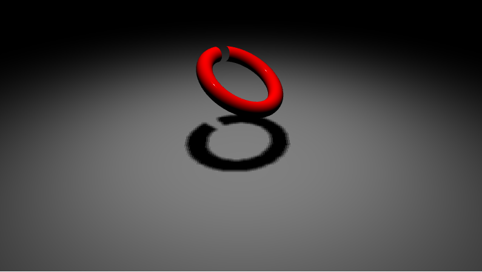

# bno055-i2c
a user-space driver library of BNO055 Orientation 9-Axis Sensor.

## Overview

* roll-pich-yaw euler angle orientation is obtainded from quaternion.
* linear acceleration can also be obrained.
* 100 Hz control cycle can be achieved by applying the preempt-rt patch.

## How to build

```
cd build
cmake ..
make
```

## Example

* WebGL animation by three.js.
* WebSocket communicates by embedding the civetweb Web server.



### How to Run Example

```
git submodule init
git submodule update
cd example
make
sudo ./bno055-i2c-example
```

Access to http://address-to-your-host:8080/
